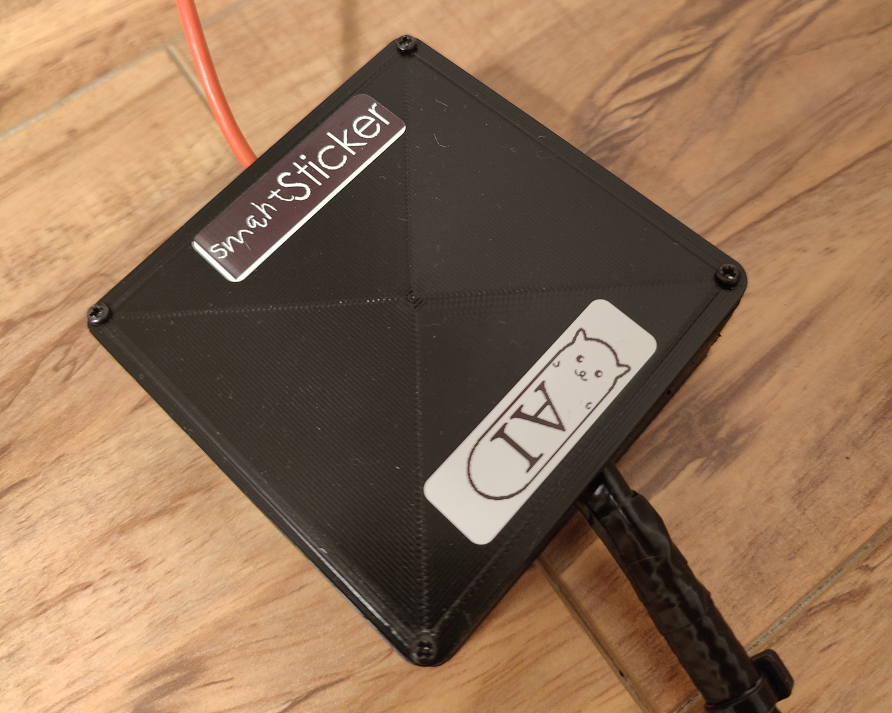
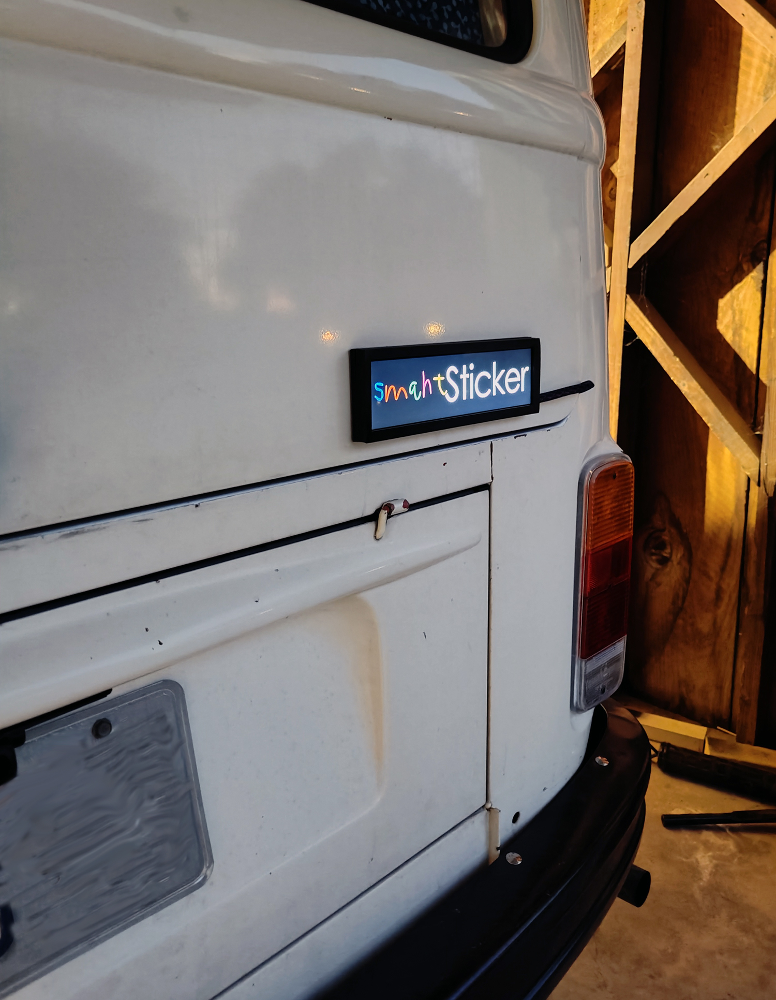

  

With the political division in the US becoming increasingly polarized and the tech industry turning just about everything "smart" and integrated with AI, I figured it was time to summon the smahtSticker! The smahtSticker is an AI powered "smart" bumper sticker designed to let you blend in to any part of town. It features a Raspberry Pi Zero paired with an ~8" LCD and GPS module to pinpoint your exact location while you're driving. With this data we turn to one of OpenAI's cutting edge AI models to accurately* predict the most likely political view of that area. The response is then used to display the appropriate bumper sticker to fit you, and your car, right in.
  
<small><i>*Using zip codes to determine political preferences is not super accurate. There are many additional factors that should be analyzed for accurate predictions, but this is all fun.</i></small>
 
 <b>Waow. So, what's actually happening?</b>
 
The GPS module is reading your location every second. If it detects you have moved 25 feet it uses [geopy](https://geopy.readthedocs.io/en/stable/) to get the zipcode of where you are. If the zipcode is different than the last zipcode that was checked, it sends a predefined message to openAI to get the probable political view of that zipcode. Its response is then used to randomly pick one of the 6 bumper stickers for that political view and display it on the LCD.

  
Since we are asking ChatGPT what it thinks the political preferences of areas are I figured it's only appropriate to also ask for suggestions regarding the types of bumper stickers to display. Seen below, I asked it what types of stickers a conservative person would have, as well as a liberal person. 

    <table>
        <tr>
            <td>
                

                    
                     ChatGPT's conservative bumper sticker suggestions.
                

            </td>
            <td>
                

                    
                     ChatGPT's liberal bumper sticker suggestions.
                

            </td>
        </tr>
    </table>

With these responses I put together 6 bumper stickers for each view. Below is a GIF of them all.

    
     All of the current bumper stickers

 
 

    
     3D Printed box housing the Raspberry Pi Zero & GPS Module.  its AI 

 

    
     smahtSticker stuck on VW Bus.

 
did I mention it has AI? 
<b>Huge disclaimer: I don't actually drive around with this thing. It's mainly a joke on tech and politics!</b>

## Parts
* [PI Zero](https://www.raspberrypi.com/products/raspberry-pi-zero/)
* [HSD088IPW1 1920x480 LCD with Driver Board](https://www.aliexpress.us/item/2255800212196996.html?gatewayAdapt=glo2usa4itemAdapt)
    * These displays require configuration to work with Pi. Luckily there's [this!](https://gist.github.com/innovodesign/3f5775d19cb890c0aa59fbb96757bf4b)
* [GPS Module](https://a.co/d/gHq3yqu)
* Project boxes or 3D print stuff.

## Instructions
1)	[Configure Rpi to Kiosk Mode](https://www.raspberrypi.com/tutorials/how-to-use-a-raspberry-pi-in-kiosk-mode/)
1)  [Install OpenAI & create an API key](https://platform.openai.com/docs/quickstart?context=python)
1)  [Install `python-dotenv`, create an .env file and slap your api key with in a variable named `OPENAI_API_KEY`](https://pypi.org/project/python-dotenv/1)
1)  [Install Openbox and configured it to run `main.py` on startup. Steps 3-9 here are helpful. No need for chromium.](https://desertbot.io/blog/raspberry-pi-4-touchscreen-kiosk-setup-64-bit-bullseye)
1)  Install `adafruit_gps`, `geopy`, and `feh`
1)  Connect GPS module to 5V, GND, and TX & RX pins of Pi.
1)  You will need to host a hotspot off your phone that the Pi can connect to.
1)  Should be ready to go! Reboot.

### Contact
devPegor@gmail.com
